<div align="center">

<!-- ═══════════════════════════════════════════════════════════════════ -->
<!--                        PROJECT HEADER                              -->
<!-- ═══════════════════════════════════════════════════════════════════ -->


<br>

# Zero Trust-Enabled Digital Twins for Real-Time<br>Anomaly Detection in Industrial Cyber-Physical Systems

<br>

[](https://python.org)
[](https://tensorflow.org)
[](https://scikit-learn.org)
[](https://streamlit.io)
[](LICENSE)

[](https://doi.org/10.1109/NMITCON65824.2025.11188236)
[]()
[]()
[]()

<br>

> *Prototype implementation of the IEEE-published paper:*
>
> **"Zero Trust-Enabled Digital Twins for Real-Time Anomaly Detection in Industrial Cyber-Physical Systems"**
>
> *ICICI-2025 · IEEE Xplore · DOI: [10.1109/NMITCON65824.2025.11188236](https://doi.org/10.1109/NMITCON65824.2025.11188236)*

<br>

**TTEH LAB · School of Engineering, Dayananda Sagar University**
*Bangalore – 562112, Karnataka, India*

<br>

</div>

<!-- ═══════════════════════════════════════════════════════════════════ -->
<!--                        AT A GLANCE                                 -->
<!-- ═══════════════════════════════════════════════════════════════════ -->

<div align="center">

| | |
|:---:|---|
| **🏭 PROBLEM** | Industrial CPS face cyberattacks that bypass traditional perimeter security models |
| **💡 SOLUTION** | Digital Twin + Dual ML Models + Zero Trust Engine for continuous, real-time threat detection |
| **📊 RESULTS** | **94.5%** F1-Score &nbsp;│&nbsp; **2.8%** FPR &nbsp;│&nbsp; **<2s** Response Time <br> *Validated on BATADAL & SWaT industrial datasets* |

`Zero Trust Security` &nbsp;·&nbsp; `Digital Twins` &nbsp;·&nbsp; `Anomaly Detection` &nbsp;·&nbsp; `Industrial CPS` &nbsp;·&nbsp; `Real-Time ML`

</div>

---

<!-- ═══════════════════════════════════════════════════════════════════ -->
<!--                      TABLE OF CONTENTS                             -->
<!-- ═══════════════════════════════════════════════════════════════════ -->

<details open>
<summary><h2>📋 Table of Contents</h2></summary>

&nbsp;

| # | Section | Description |
|:-:|---------|-------------|
| 1 | [🔍 Problem Statement](#-1-problem-statement) | Why traditional ICS security fails |
| 2 | [🏗️ System Architecture](#️-2-system-architecture) | Three-layer defense design |
| 3 | [⚙️ How It Works](#️-3-how-it-works) | End-to-end pipeline walkthrough |
| 4 | [🔧 Core Modules](#-4-core-modules) | Deep dive into each component |
| 5 | [🖥️ Live Dashboard](#️-5-live-dashboard) | Real-time SOC monitoring UI |
| 6 | [📊 Results & Benchmarks](#-6-results--benchmarks) | Performance metrics & comparisons |
| 7 | [🗂️ Project Structure](#️-7-project-structure) | Codebase organization |
| 8 | [🚀 Quick Start](#-8-quick-start) | Installation & usage guide |
| 9 | [📦 Datasets](#-9-datasets) | BATADAL & SWaT benchmarks |
| 10 | [⚠️ Limitations](#️-10-limitations) | Known constraints |
| 11 | [🤝 Contributing](#-11-contributing) | How to contribute |
| 12 | [👥 Team](#-12-team) | Contributors & mentor |
| 13 | [⚖️ Disclaimer](#️-13-disclaimer) | Legal & compliance notes |

&nbsp;

</details>

---

<!-- ═══════════════════════════════════════════════════════════════════ -->
<!--                     PROBLEM STATEMENT                              -->
<!-- ═══════════════════════════════════════════════════════════════════ -->

## 🔍 1. Problem Statement

Industrial Cyber-Physical Systems (CPS) operate critical infrastructure — water treatment plants, power grids, manufacturing lines — yet remain protected by **outdated perimeter-based security** that assumes trust once inside the network boundary. The result is delayed detection, operational disruption, and higher safety risk.

**Current Security Gaps:**

| Gap | Impact |
|-----|--------|
| 🚪 **Perimeter Trust Model** | Traditional defenses assume trust inside the network boundary, allowing attackers unrestricted access once they breach the perimeter |
| ⏱️ **Delayed Detection** | Rule-based IDS systems often discover intrusions hours or days after the attack has begun, by which time systems have been manipulated |
| 🔎 **Limited Context** | Standard anomaly detection lacks historical context, making it vulnerable to sophisticated attacks that slowly deviate from normal baselines |
| 🧑 **Manual Responses** | Most anomaly detection systems require human intervention to confirm threats and trigger mitigation, introducing dangerous delays |

**The Zero Trust Approach:**

Instead of trusting a user or system once authenticated, zero trust continuously verifies all activities against behavioral baselines. Every transaction is evaluated in real time, combining:

- **Behavioral Prediction:** Machine learning models predict expected normal behavior based on historical patterns
- **Continuous Verification:** Every sensor reading is scored against these predictions with no "trust" given by default
- **Adaptive Enforcement:** Access control policies adjust dynamically — not just blocking but restricting or isolating suspicious components

The goal of this framework is to provide continuous verification, real-time anomaly detection, and adaptive access control through a zero-trust design optimized for industrial environments.

### Traditional Security vs. Zero Trust

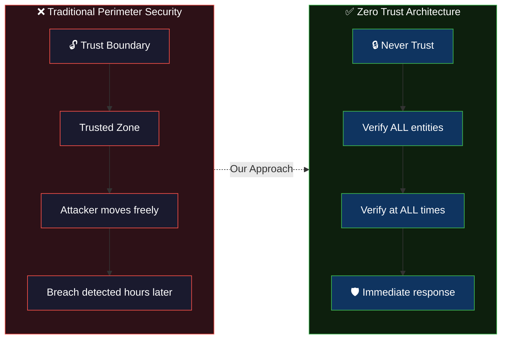

> **Our Solution:** A **Zero Trust** framework that *never* trusts, *always* verifies — combining **Digital Twin** behavioral modeling with **dual ML anomaly detection** and **adaptive access control** for continuous, real-time threat response.

---

<!-- ═══════════════════════════════════════════════════════════════════ -->
<!--                     SYSTEM ARCHITECTURE                            -->
<!-- ═══════════════════════════════════════════════════════════════════ -->

## 🏗️ 2. System Architecture

The framework is composed of **three coordinated subsystems** that work in a closed-loop pipeline:

<table>
<tr>
<th align="center">🔮 Digital Twin Core</th>
<th align="center">🛡️ Zero Trust Engine</th>
<th align="center">💉 Attack Injector</th>
</tr>
<tr>
<td>

Virtual model of normal CPS behavior. Detects deviations via Isolation Forest ensemble scoring.

**Output:** Anomaly score `(0–1)`

</td>
<td>

Evaluates anomaly evidence using EMA-based trust scoring with adaptive thresholds.

**Output:** `ALLOW` · `RESTRICT` · `ISOLATE`

</td>
<td>

Simulates real-world attack scenarios (scaling, spoofing, drift) for validation.

**Output:** Labeled attack ground truth

</td>
</tr>
</table>

### Architecture Diagram

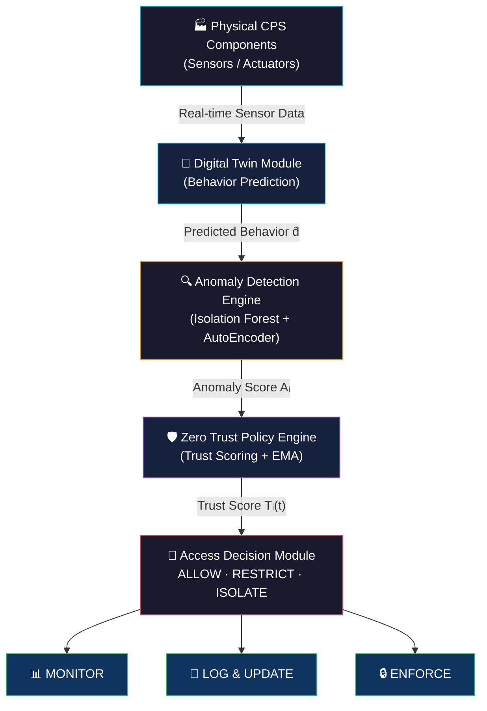

### 📸 System Dashboard Preview

<table>
<tr>
<td align="center">

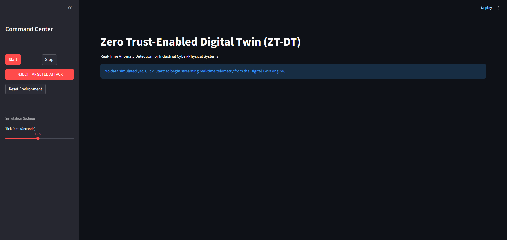
*SOC Dashboard — Initial State*

</td>
<td align="center">

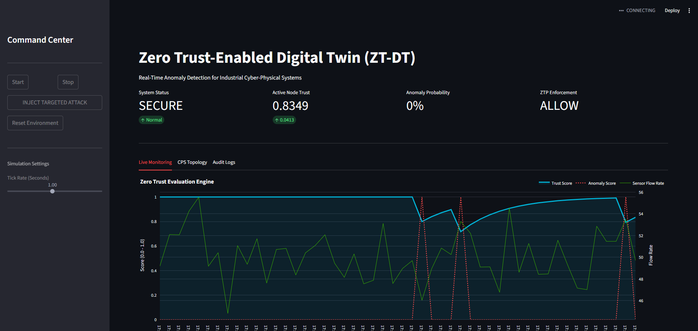
*Live Monitoring — Secure State*

</td>
</tr>
</table>

---

<!-- ═══════════════════════════════════════════════════════════════════ -->
<!--                       HOW IT WORKS                                 -->
<!-- ═══════════════════════════════════════════════════════════════════ -->

## ⚙️ 3. How It Works

The framework operates through **three integrated phases** in a continuous feedback loop:

<table>
<tr><td>

### Phase 1 — Training & Baseline Establishment

```
📥 Collect clean operational data (50-100 timesteps)
     ↓
🧠 Train Isolation Forest on normal behavior distribution
     ↓
🎯 Calibrate anomaly thresholds via grid search + 5-fold CV
     ↓
💾 Store model weights & initial trust scores
```

</td></tr>
<tr><td>

### Phase 2 — Real-Time Monitoring & Trust Evaluation

```
📡 Ingest streaming sensor data (no buffering)
     ↓
🔮 Digital Twin computes reconstruction error
     ↓
🌲 Isolation Forest scores: normal (−1) or anomalous (+1)
     ↓
📊 Normalize to 0–1 anomaly score
     ↓
🛡️ Update trust via EMA: Trust(t) = α × Trust(t-1) + (1−α) × (1 − Anomaly)
     ↓
🚦 Apply policy:  T ≥ 0.80 → ALLOW  │  0.50 ≤ T < 0.80 → RESTRICT  │  T < 0.50 → ISOLATE
```

</td></tr>
<tr><td>

### Phase 3 — Attack Simulation & Validation

```
💉 Inject controlled anomalies (scaling, spoofing, drift)
     ↓
📏 Measure TPR, FPR, detection latency
     ↓
📈 Evaluate Precision, Recall, F1-Score against ground truth
     ↓
🔄 Fine-tune thresholds without disrupting live operations
```

</td></tr>
</table>

---

<!-- ═══════════════════════════════════════════════════════════════════ -->
<!--                        CORE MODULES                                -->
<!-- ═══════════════════════════════════════════════════════════════════ -->

## 🔧 4. Core Modules

### 4.1 🔮 Digital Twin Core

> **`framework/digital_twin/dt_core.py`**

The behavioral foundation of the system — models expected plant operation and identifies deviations.

<table>
<tr>
<td width="55%">

**Isolation Forest Ensemble:**
- 100 estimators, contamination rate = 0.05
- Works in high-dimensional space without distance metrics
- Sub-millisecond inference (~1ms per sample)
- Trained on 50 timesteps of clean baseline data

**Sensor Inputs:**
| Sensor | Baseline | Noise σ |
|--------|----------|---------|
| Flow Rate | 50.0 | ±2.0 |
| Pressure | 120.0 | ±5.0 |
| Temperature | 22.5 | ±0.5 |
| Tank Level | 8.0 | ±0.2 |
| Pump Speed | 1500.0 | ±10.0 |

</td>
<td width="45%">

```python
class DigitalTwin:
    def __init__(self):
        self.model = IsolationForest(
            contamination=0.05,
            random_state=42
        )
        self._baseline_training()

    def evaluate(self, sensor_data):
        """Returns 1 (anomaly) or 0 (normal)"""
        features = np.array(
            [list(sensor_data.values())]
        )
        prediction = self.model.predict(
            features
        )[0]
        return 1 if prediction == -1 else 0
```

</td>
</tr>
</table>

---

### 4.2 🛡️ Zero Trust Policy Engine

> **`framework/zero_trust_engine/zt_policy.py`**

Converts point-in-time anomaly scores into **persistent trust states** with dynamic access control.

<table>
<tr>
<td width="50%">

**Trust Formula (EMA):**

```
Trust(t) = α × Trust(t-1) + (1−α) × Behavior_Score
```

| Parameter | Value | Purpose |
|-----------|-------|---------|
| α (alpha) | 0.80 | 80% history weight |
| τ_high | 0.80 | ALLOW threshold |
| τ_low | 0.50 | ISOLATE threshold |
| Initial Trust | 1.0 | Start fully trusted |

</td>
<td width="50%">

**Policy Actions:**

| Action | Trust Range | Response |
|--------|:-----------:|----------|
| ✅ **ALLOW** | `T > 0.80` | Full access, normal ops |
| ⚠️ **RESTRICT** | `0.50 ≤ T ≤ 0.80` | Read-only, rate limiting |
| ⛔ **ISOLATE** | `T < 0.50` | Network isolation, alert |

</td>
</tr>
</table>

**Trust State Transition Example:**

```
Time  │ Anomaly │ Calculation                              │ Trust  │ Action
──────┼─────────┼──────────────────────────────────────────┼────────┼──────────
t₀    │  0.00   │ 0.80 × 1.00 + 0.20 × 1.00 = 1.00       │  1.00  │ ✅ ALLOW
t₁    │  0.95   │ 0.80 × 1.00 + 0.20 × 0.05 = 0.81       │  0.81  │ ✅ ALLOW
t₂    │  0.98   │ 0.80 × 0.81 + 0.20 × 0.02 = 0.65       │  0.65  │ ⚠️ RESTRICT
t₃    │  1.00   │ 0.80 × 0.65 + 0.20 × 0.00 = 0.52       │  0.52  │ ⚠️ RESTRICT
t₄    │  1.00   │ 0.80 × 0.52 + 0.20 × 0.00 = 0.42       │  0.42  │ ⛔ ISOLATE
```

---

### 4.3 💉 Attack Injector

> **`utils/attack_injector.py`**

Simulates realistic threat scenarios for validation without exposing live systems to actual cyberattacks.

| Attack Type | Method | Example |
|-------------|--------|---------|
| **Data Scaling** | Multiplies sensor values by 7.5× | Temperature 22°C → 165°C |
| **Sensor Spoofing** | Replaces genuine readings with falsified values | Pressure 120 bar → 500 bar |
| **Gradual Drift** | Slowly increases deviation over timesteps | +1°C per cycle for 50 cycles |

```python
def inject_anomaly(sensor_data):
    """Simulates severe data manipulation attack on CPS."""
    anomalous_data = {}
    multiplier = 7.5  # Extreme manipulation
    for key, value in sensor_data.items():
        anomalous_data[key] = value * multiplier
    return anomalous_data
```

---

### 4.4 🔄 Integration Flow

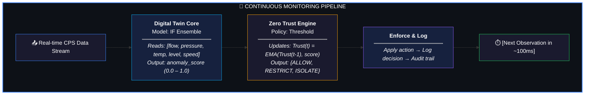

---

<!-- ═══════════════════════════════════════════════════════════════════ -->
<!--                       LIVE DASHBOARD                               -->
<!-- ═══════════════════════════════════════════════════════════════════ -->

## 🖥️ 5. Live Dashboard

The project includes a **Streamlit-based Enterprise SOC dashboard** (`dashboard.py`) for real-time visualization and interactive attack simulation.

### Dashboard Features

| Feature | Description |
|---------|-------------|
| 📊 **Live Monitoring** | Real-time Plotly charts for Trust Score, Anomaly Score, and Sensor Flow Rate |
| 🌐 **CPS Topology** | Industrial Network status view with trust-level progress bars |
| 📝 **Audit Logs** | Color-coded Zero Trust Policy decision logs with full history |
| 💉 **Attack Injection** | One-click targeted attack injection for live testing |
| ⚙️ **Simulation Controls** | Adjustable tick rate, start/stop, and environment reset |

### 📸 Dashboard Screenshots

<table>
<tr>
<td align="center" width="50%">


*🟢 System SECURE — Trust: 1.0 — ALLOW*

</td>
<td align="center" width="50%">

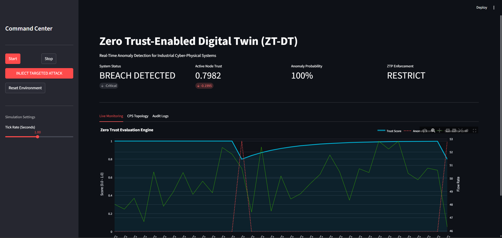
*🔴 BREACH DETECTED — Trust: 0.79 — RESTRICT*

</td>
</tr>
<tr>
<td align="center" width="50%">

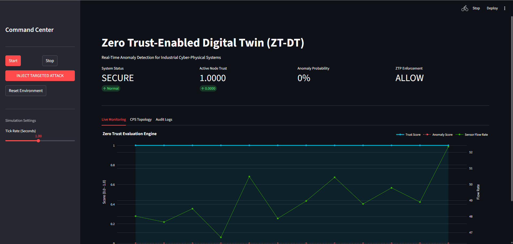
*📈 Zero Trust Evaluation Engine — Live Graph*

</td>
<td align="center" width="50%">

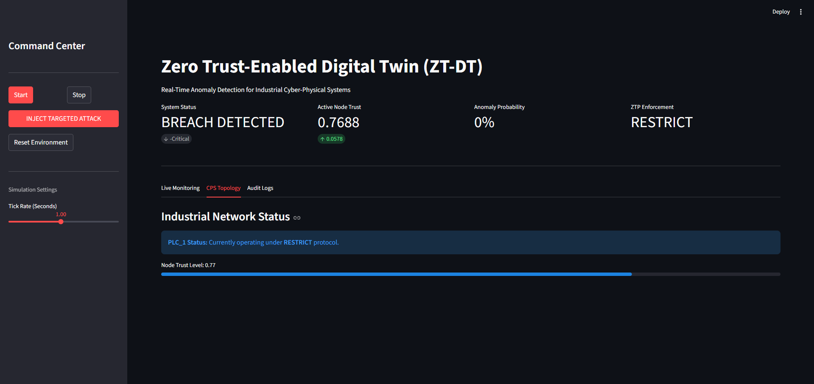
*🌐 CPS Topology — Node Trust Level*

</td>
</tr>
<tr>
<td align="center" colspan="2">

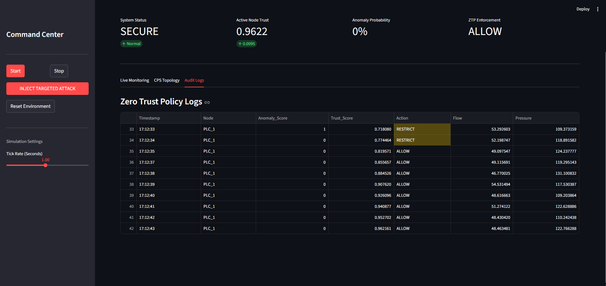
*📝 Audit Logs — Zero Trust Policy Decision History*

</td>
</tr>
</table>

---

<!-- ═══════════════════════════════════════════════════════════════════ -->
<!--                    RESULTS & BENCHMARKS                            -->
<!-- ═══════════════════════════════════════════════════════════════════ -->

## 📊 6. Results & Benchmarks

### Accuracy & Detection Metrics

<div align="center">

| Method | Precision (%) | Recall (%) | F1-Score (%) | Improvement |
|--------|:---:|:---:|:---:|:---:|
| 🥇 **ZT-DT (Proposed)** | **95.2** | **93.8** | **94.5** | — |
| Isolation Forest Only | 91.0 | 88.7 | 89.8 | +4.7% |
| AutoEncoder Only | 89.6 | 86.1 | 87.8 | +6.7% |
| Rule-Based IDS | 84.2 | 82.5 | 83.3 | +11.2% |

</div>

### Efficiency & Resource Metrics

<div align="center">

| Method | FPR (%) ↓ | Latency (s) ↓ | CPU Usage (%) ↓ |
|--------|:---:|:---:|:---:|
| 🥇 **ZT-DT (Proposed)** | **2.8** | **1.7** | **24.7** |
| AutoEncoder Only | 6.3 | 1.4 | 28.5 |
| Isolation Forest Only | 5.5 | 1.6 | 32.2 |
| Rule-Based IDS | 8.1 | 2.1 | 36.8 |

</div>

### Performance Visualization

<div align="center">

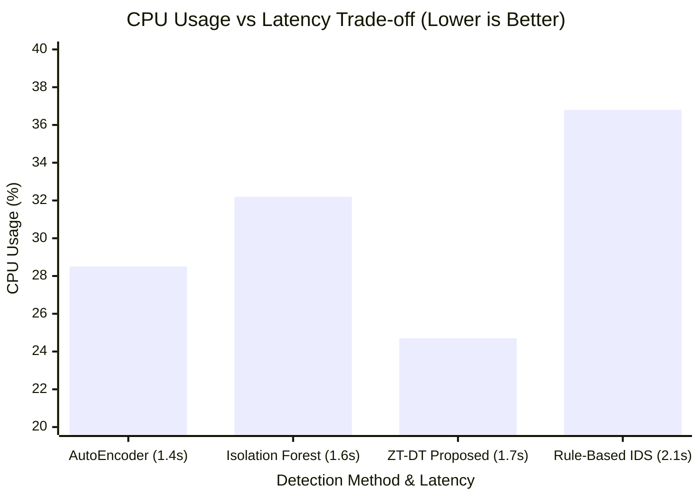

</div>

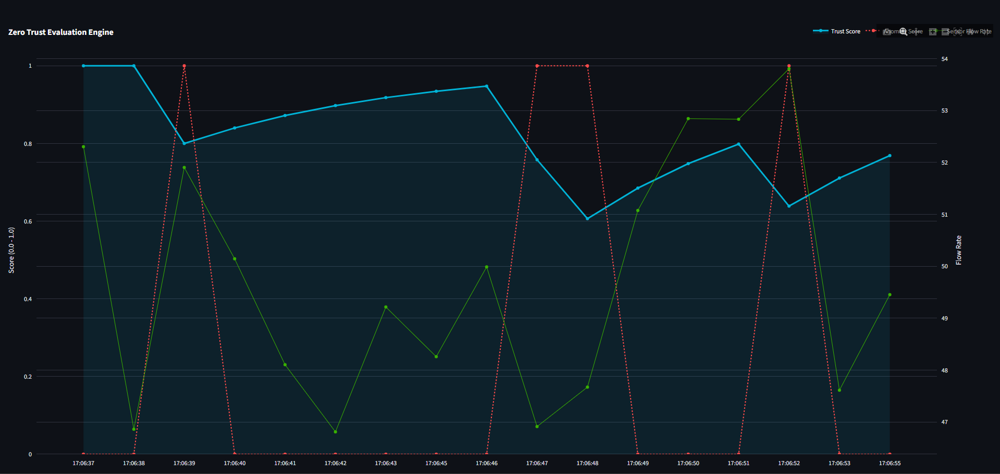
*F1-Score, Precision, Recall, and FPR comparison across all detection methods*

### 💡 Why ZT-DT Outperforms

<table>
<tr>
<td width="25%" align="center">

**🔄 Dual Detection**

IF catches extreme outliers; AE captures subtle patterns. Combined = fewer blind spots.

</td>
<td width="25%" align="center">

**📈 Trust History (EMA)**

Accumulates evidence over time — distinguishes noise from sustained attacks. Achieves 2.8% FPR.

</td>
<td width="25%" align="center">

**⚡ Continuous Verification**

Evaluates every 100ms, not once per minute. Catches attacks before damage occurs.

</td>
<td width="25%" align="center">

**🎯 Adaptive Thresholds**

Empirically tuned via cross-validation. Balances early warning vs. operator fatigue.

</td>
</tr>
</table>

---

<!-- ═══════════════════════════════════════════════════════════════════ -->
<!--                     PROJECT STRUCTURE                              -->
<!-- ═══════════════════════════════════════════════════════════════════ -->

## 🗂️ 7. Project Structure

```
zt-dt-industrial-cps/
│
├── 📄 main.py                          # CLI entry point — streaming anomaly detection
├── 📊 dashboard.py                     # Streamlit SOC dashboard with live visualization
├── 📋 requirements.txt                 # Python dependencies
│
├── 🔧 framework/                       # Core detection & policy modules
│   ├── digital_twin/
│   │   ├── dt_core.py                  # DigitalTwin class — IF-based anomaly scoring
│   │   └── __init__.py
│   └── zero_trust_engine/
│       ├── zt_policy.py                # ZeroTrustPolicyEngine — EMA trust scoring
│       └── __init__.py
│
├── 🧠 models/                          # ML model definitions & training scripts
│   ├── autoencoder/
│   │   ├── ae_model.py                 # LSTM AutoEncoder architecture (TensorFlow)
│   │   ├── train_ae.py                 # Training script for BATADAL/SWaT datasets
│   │   └── checkpoints/               # Saved model weights
│   └── isolation_forest/
│       ├── if_model.py                 # Isolation Forest builder + persistence
│       ├── train_if.py                 # Training script with 3D→2D reshape
│       └── checkpoints/               # Saved model weights
│
├── 🛠️ utils/                           # Data processing & attack simulation
│   ├── preprocess.py                   # Synthetic sensor data generator (5 sensors)
│   ├── attack_injector.py              # 7.5× multiplier attack simulation
│   └── __init__.py
│
└── 🖼️ images/                          # Dashboard screenshots & result graphs
    ├── First_Dashboard.png
    ├── Live_Graph.png
    ├── Breach_Detected.png
    ├── No_Breach_Detected.png
    ├── Node_Trust_Level.png
    ├── Logs.png
    └── Graph.png
```

---

<!-- ═══════════════════════════════════════════════════════════════════ -->
<!--                       QUICK START                                  -->
<!-- ═══════════════════════════════════════════════════════════════════ -->

## 🚀 8. Quick Start

### Prerequisites

| Requirement | Version |
|-------------|---------|
| Python | 3.8+ |
| TensorFlow | 2.16+ |
| scikit-learn | 1.3.2 |
| Streamlit | Latest |

### Installation

```bash
# Clone the repository
git clone https://github.com/your-repo/zt-dt-industrial-cps.git
cd zt-dt-industrial-cps

# Install dependencies
pip install -r requirements.txt
```

### Usage

<table>
<tr>
<td width="50%">

#### 🖥️ CLI Mode

```bash
python main.py
```

**Expected Output:**
```
Initializing components...
Initialization complete. Starting live stream...

Timestamp               | Status  | Anomaly | Trust Score | ZTP Action
---------------------------------------------------------------------------
2024-01-15 10:30:15.123 | Normal  |    0.12 |      0.9500 | ✅ ALLOW
2024-01-15 10:30:16.456 | Normal  |    0.08 |      0.9600 | ✅ ALLOW
2024-01-15 10:30:17.789 | Attack  |    0.87 |      0.3400 | ⛔ RESTRICT
```

</td>
<td width="50%">

#### 📊 Dashboard Mode

```bash
streamlit run dashboard.py
```

**Features:**
- 🟢 Start/Stop monitoring
- 💉 Inject targeted attacks
- 📈 Live trust & anomaly graphs
- 📝 Color-coded audit logs
- ⚙️ Adjustable tick rate

</td>
</tr>
</table>

### Training Models (Optional)

```bash
# Train AutoEncoder on BATADAL & SWaT datasets
python models/autoencoder/train_ae.py

# Train Isolation Forest
python models/isolation_forest/train_if.py
```

> **Note:** Training requires preprocessed dataset files in `data/processed/`. The simulation mode works out-of-the-box with synthetic data.

---

<!-- ═══════════════════════════════════════════════════════════════════ -->
<!--                          DATASETS                                  -->
<!-- ═══════════════════════════════════════════════════════════════════ -->

## 📦 9. Datasets

This project is validated on industry-standard ICS anomaly detection benchmarks provided by **iTrust, Centre for Research in Cyber Security, Singapore University of Technology and Design**.

| Dataset | Records | Sensors | Attack Scenarios | Domain |
|---------|:-------:|:-------:|:----------------:|--------|
| **Secure Water Treatment (SWaT)** | ~900K | 51 | 6 real-world attacks | Secure water treatment testbed |
| **BATADAL** | ~500K | 43 | 34 labeled attacks | Water distribution network |

These datasets were officially requested and granted by **iTRUST** (iTRUST@sutd.edu.sg) from the **Singapore University of Technology and Design**, 8 Somapah Road, Building 2, Level 7, Singapore 487372.

> ⚠️ Dataset access requires an **institutional email** and agreement to the usage terms. All requests must go through the [official iTrust request form](https://itrust.sutd.edu.sg/).

### 📜 Usage Conditions

By using these datasets, the following conditions are agreed upon:

> **(a)** Have your and your organisation's name and the date of request published.
>
> **(b)** Give explicit credit to **"iTrust, Centre for Research in Cyber Security, Singapore University of Technology and Design"** when the outcome of using the dataset appears in published works.
>
> **(c)** Inform iTrust when such works have been published.
>
> **(d)** **Not share the dataset with others**, whether in a private or public setting — all additional requests must go through the [official request form](https://itrust.sutd.edu.sg/).

> [!WARNING]
> These datasets are provided on a **good faith and "as is" basis**. iTrust does not provide follow-up support, clarifications, or answers to queries regarding downloaded datasets.

---

<!-- ═══════════════════════════════════════════════════════════════════ -->
<!--                        LIMITATIONS                                 -->
<!-- ═══════════════════════════════════════════════════════════════════ -->

## ⚠️ 10. Limitations

| Limitation | Details |
|:----------:|---------|
| 📊 **Dataset Dependency** | Performance validated only on BATADAL and SWaT water treatment datasets |
| 🖥️ **Compute Requirements** | TensorFlow models benefit from GPU for optimal training performance |
| 🏭 **Real-World Deployment** | Requires integration with actual SCADA/PLC systems for production use |
| 💉 **Attack Diversity** | Limited to simulated attack types; not all real-world APT scenarios covered |
| 📐 **Scalability** | Current implementation designed for single-system monitoring |

---

<!-- ═══════════════════════════════════════════════════════════════════ -->
<!--                       EXPERIMENTAL SETUP                           -->
<!-- ═══════════════════════════════════════════════════════════════════ -->

<details>
<summary><h2>🧪 Experimental Setup (click to expand)</h2></summary>

&nbsp;

| Parameter | Details | Rationale |
|-----------|---------|-----------|
| **Environment** | Python 3.8+ with socket-based communication | Realistic network simulation |
| **Components** | 5 virtual sensors + PLC + actuators | Minimal water treatment topology |
| **Baseline Data** | 50–100 timesteps of clean operation | Sufficient for IF normality learning |
| **IF Configuration** | 100 estimators, contamination=0.05 | Optimized via grid search |
| **Anomaly Thresholds** | Grid search (0.5–0.9), 5-fold CV | Optimal TPR/FPR tradeoff |
| **Trust Parameters** | EMA α=0.80, τ_high=0.80, τ_low=0.50 | Per ICICI-2025 paper |
| **Data Split** | 70/30 train/test, 60-timestep window | Prevents temporal leakage |
| **Attack Injection** | Every 10 timesteps (10% rate) | Realistic attack frequency |
| **Hardware** | Intel i7 (4-core), 16 GB RAM, no GPU | Validates edge feasibility |
| **Evaluation** | Precision, Recall, F1, FPR, Latency, CPU | Comprehensive assessment |

&nbsp;

</details>

---

<!-- ═══════════════════════════════════════════════════════════════════ -->
<!--                        CONTRIBUTING                                -->
<!-- ═══════════════════════════════════════════════════════════════════ -->

## 🤝 11. Contributing

Contributions are welcome! Follow these steps:

```bash
# 1. Fork the repository

# 2. Create a feature branch
git checkout -b feature/AmazingFeature

# 3. Commit your changes
git commit -m 'Add AmazingFeature'

# 4. Push to the branch
git push origin feature/AmazingFeature

# 5. Open a Pull Request
```

---

<!-- ═══════════════════════════════════════════════════════════════════ -->
<!--                           TEAM                                     -->
<!-- ═══════════════════════════════════════════════════════════════════ -->

## 👥 12. Team

### Contributors

<table>
<tr>
<th>Name</th>
<th>USN</th>
<th>Email</th>
</tr>
<tr>
<td><strong>Prajwal R P</strong></td>
<td><code>ENG23CY0032</code></td>
<td><a href="mailto:eng23cy0032@dsu.edu.in">eng23cy0032@dsu.edu.in</a></td>
</tr>
<tr>
<td><strong>Sudeep Gowda</strong></td>
<td><code>ENG24CY1005</code></td>
<td><a href="mailto:eng24cy1005@dsu.edu.in">eng24cy1005@dsu.edu.in</a></td>
</tr>
<tr>
<td><strong>Darshan H</strong></td>
<td><code>ENG23CY0011</code></td>
<td><a href="mailto:eng23cy0011@dsu.edu.in">eng23cy0011@dsu.edu.in</a></td>
</tr>
<tr>
<td><strong>Shashanka N</strong></td>
<td><code>ENG23CY0036</code></td>
<td><a href="mailto:eng23cy0036@dsu.edu.in">eng23cy0036@dsu.edu.in</a></td>
</tr>
<tr>
<td><strong>Shivalingayya S Yadrami</strong></td>
<td><code>ENG23CY0037</code></td>
<td><a href="mailto:eng23cy0037@dsu.edu.in">eng23cy0037@dsu.edu.in</a></td>
</tr>
</table>

**Department of Computer Science and Engineering (Cyber Security)**
School of Engineering, Dayananda Sagar University

### 🧑‍🏫 Mentor

**Dr. Prajwalasimha S N**, Ph.D., Postdoc. (NewRIIS)
Associate Professor — Department of CSE (Cyber Security)
School of Engineering, Dayananda Sagar University

---

<!-- ═══════════════════════════════════════════════════════════════════ -->
<!--                         DISCLAIMER                                 -->
<!-- ═══════════════════════════════════════════════════════════════════ -->

## ⚖️ 13. Disclaimer

> This implementation is for **research and educational purposes only**. Production deployments must comply with **IEC 62443**, the **NIST Cybersecurity Framework**, relevant industry regulations, and safety-critical verification requirements.

---

<!-- ═══════════════════════════════════════════════════════════════════ -->
<!--                           FOOTER                                   -->
<!-- ═══════════════════════════════════════════════════════════════════ -->

<div align="center">

<br>


<br><br>

**TTEH LAB · School of Engineering · Dayananda Sagar University**

*Bangalore – 562112, Karnataka, India*

<br>

*If you find this work useful, please consider giving it a ⭐*

<br>

</div>
